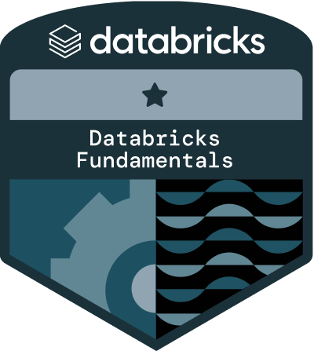
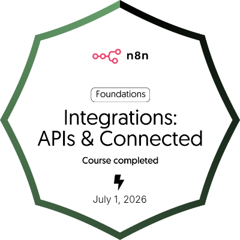
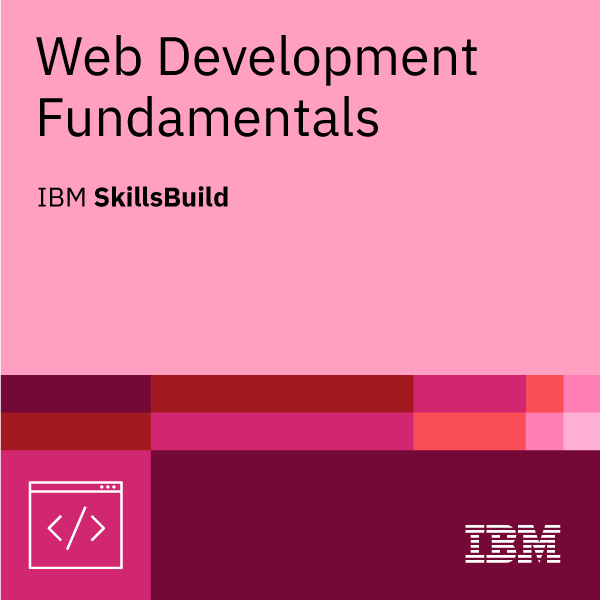
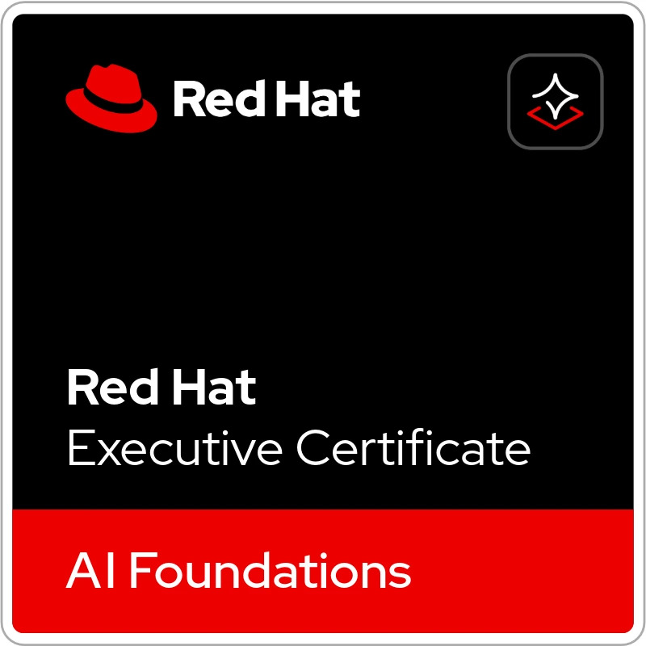
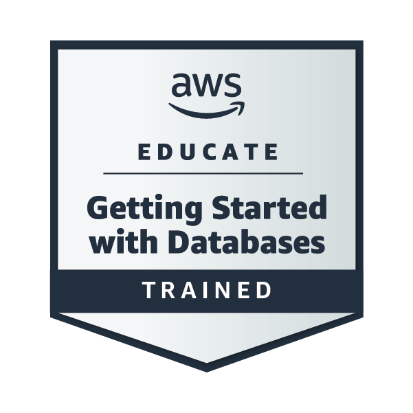
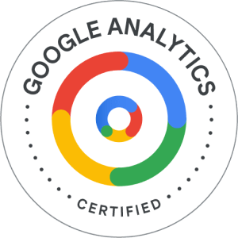
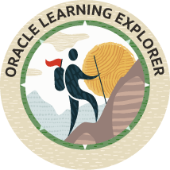
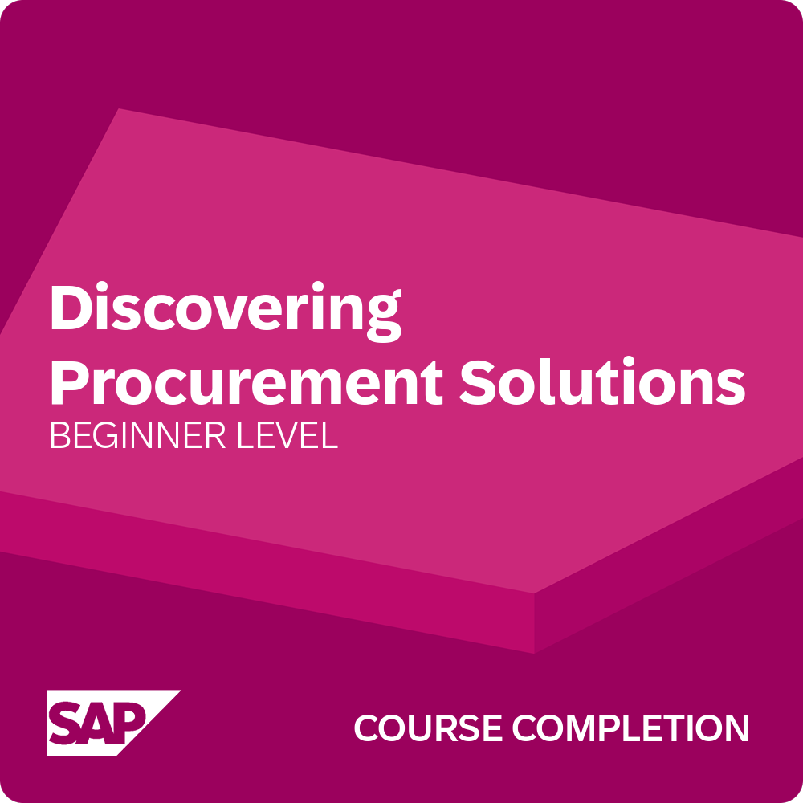

<div align="center">
  

  <h3>👋 Olá! Eu sou <strong>Pedro Aruanã</strong></h3>
  <h4>🚀 Desenvolvedor Front End Júnior | Explorador de stacks | Builder de coisas legais</h4>

  <a href="https://www.linkedin.com/in/pedro-aruan%C3%A3-599105322/">
    
  </a>
  <a href="https://github.com/pedroaruana">
    
  </a>
  <a href="mailto:aruanapedro@gmail.com">
    
  </a>
  <a href="https://portifiolio-pedro.vercel.app">
    
  </a>
  <br/><br/>
    <p align="center">
      
      
      
      
      
      
      
      
      
      
      
      
      
    
       
      
      
      
      
      
      
      
    </p>
</div>

---

## 🧑‍💻 Sobre mim

```javascript
const pedro = {
  nome: "Pedro Aruanã Silva Mascarenhas",
  role: "Front End Developer com experiência Full Stack",
  level: "Desenvolvedor em constante evolução",
  localização: "Brasil 🇧🇷",

  foco: ["interfaces modernas", "código limpo", "performance", "projetos reais"],

  atualmente:
    "Desenvolvendo aplicações web e mobile, integrando APIs, IA, automações e arquiteturas escaláveis.",

  diferenciais: [
    "🎨 Interfaces modernas com foco em UX/UI",
    "⚛️ Componentização e arquitetura escalável",
    "🔗 Integração de APIs REST e serviços externos",
    "🤖 IA, RAG, agentes e automações com n8n",
    "📊 Dashboards e análise de dados com Power BI",
    "🚀 Experiência Full Stack para entrega ponta a ponta"
  ],

  curiosidades: [
    "💻 Desenvolvo soluções que conectam Front End, Back End, IA e automações.",
    "🤖 Experiência integrando IA, RAG e automações com n8n.",
    "⚡ Foco em componentização, performance e código escalável."
  ]
};
```

---

## 🛠️ Stack & Ferramentas

### Front End


### Back End & APIs


### Testes


### Banco de Dados


### IA & Outros


## 🚀 Projetos em destaque

### 🤖 [HireMind AI](https://github.com/pedroaruana/hiremind-ai)
> Sistema full-stack de análise de currículos com IA — processa CVs, extrai habilidades automaticamente e classifica candidatos por nível e função.
> `Python` `IA` `Full Stack`

---

### 🎮 [GameHub](https://github.com/pedroaruana/gamehub-)
> E-commerce Full Stack de jogos digitais inspirado na Steam e Nuuvem. Autenticação, carrinho, favoritos e checkout completo.
> `HTML` `CSS` `JavaScript` `Python` `FastAPI` `Supabase`

---

### 🦎 [Crocodilo Burguer](https://github.com/pedroaruana/CrocodiloBurguer)
> Sistema de hamburgueria com interface interativa e gerenciamento de pedidos.
> `JavaScript`

---
 ### 🖥️ [HelpDeskEA](https://github.com/Pedroaruana/HelpDeskEA)
> Sistema de Help Desk para suporte de T.I — abertura e acompanhamento de chamados, dashboard com métricas e filtros em tempo real.
> `Angular 17` `Angular Material` `CI/CD` `GitHub Actions`

---

### 💣 [NukeMap App](https://github.com/pedroaruana/nukemap-app)
> App mobile com mapa interativo em satélite simulando áreas de impacto a partir de um ponto central.
> `React Native` `TypeScript` `Expo`
---

### 🤖 [BotGram](https://github.com/Pedroaruana/BotGram)
> Construtor visual de bots de venda para o Telegram — configura produtos, mensagens e preços e gera o código do bot pronto pra rodar.
> `Angular 21` `TypeScript` `Tailwind CSS v4` `Node.js` 

---

## 📊 Contribuições

<div align="center">


<picture>
  <source media="(prefers-color-scheme: dark)" srcset="https://raw.githubusercontent.com/Pedroaruana/Pedroaruana/output/galaga-contribution-graph-dark.svg">
  <source media="(prefers-color-scheme: light)" srcset="https://raw.githubusercontent.com/Pedroaruana/Pedroaruana/output/galaga-contribution-graph.svg">
  
</picture>

</div>

---

---

## 🌱 Atualmente estudando

- Estudando Angular Signals e standalone components
- Implementando testes unitários com Jest
- Integrações com IA e LLMs em aplicações reais

---

<div align="center">

### 💬 Bora trocar ideia?

Se você curtiu algum projeto, tem uma oportunidade ou só quer bater um papo sobre tech — me chama!

[](https://www.linkedin.com/in/pedro-aruan%C3%A3-599105322/)
 <a href="mailto:aruanapedro@gmail.com">
    
  </a>
--- 

*"O sucesso é a soma de pequenos esforços repetidos dia após dia." – Robert Collier*

</div>
